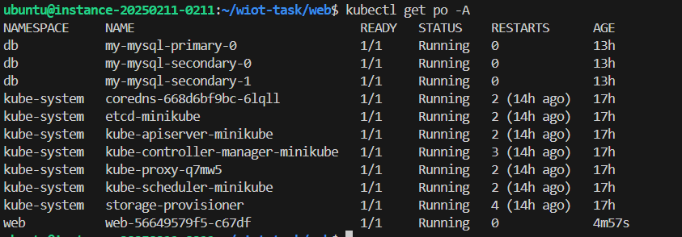
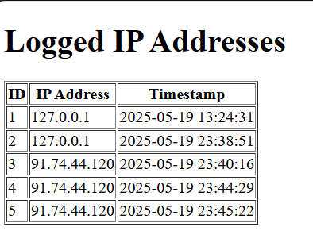
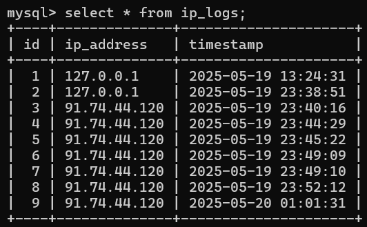

# 🛡️ IP Logger

A simple Flask-based API service to log incoming client IP addresses into a MySQL Cluster. Built with Docker and Kubernetes in mind.

---

## 📋 Prerequisites

To run and test this application, ensure the following tools are installed:

- Min 2 vcpu processor and 2 GB memory
- [Docker](https://www.docker.com/)
- [minikube](https://minikube.sigs.k8s.io/docs/start/?arch=%2Fwindows%2Fx86-64%2Fstable%2F.exe+download) or any standalon kubernetes solution
- [kubectl](https://kubernetes.io/docs/tasks/tools/)
- [helm](https://helm.sh/docs/intro/install/)

---

## ⚙️ Setup Instructions

### 1. Clone the Repository

```bash
git clone https://github.com/HosHaggag/iplogger.git
cd iplogger
```

### 2. Create two namespaces for DB and Web app
``` bash 
kubectl create ns db
kubectl create ns web
```

### 3. Install mysql helm chart using helm 
``` bash
helm repo add bitnami https://charts.bitnami.com/bitnami
helm install mysql bitnami/mysql --version 13.0.0 --values mysql/values.yaml --namespace db --atomic
```

### 4. Apply the app configuration 
``` bash 
kubectl apply -f kubernetes/configmap.yaml -n web
kubectl apply -f kubernetes/secret.yaml -n web
kubectl apply -f kubernetes/deployment.yaml -n web
kubectl apply -f kubernetes/service.yaml -n web
```
once the deployment is running the database will initiate automaticlly by poststart hook.


### 5. Test your setup
take a look on your setup using the following command 
```bash
kubectl get pod -A
```
you should see something similar to this.



### 6. For testing this application publiclly 
```bash 
kubectl port-forward service/web-service 5000:5000 -n web --address='0.0.0.0'

curl http://<your-machine-ip>:5000/
```
You should see some thing similar to this

 

### 7. Validate mysql replication 
You have to see the same data on any secondry replica 
the easiest way to see that that to get into the the replica if you connected to primary and select the data in the table 
```bash 
kubectl exec -it mysql-secondary-0 -- bash

mysql -u <username> -p 

    use iplogger;
    select * from ip_logs;
```
You should also see something similar to this 

 


## ✅ How to Test the API

Log an IP
```bash
curl -X POST http://localhost:8080/log-ip
```
View Logged IPs
```bash
curl http://localhost:8080/
```


## ⚠️ Limitations & Considerations
* No authentication: This is a simple, unauthenticated API.

* No rate-limiting: Spam protection is not included.

* MySQL connection: Assumes an available and reachable MySQL instance.

* No IP duplication check.

* Assumes MySQL is pre-initialized with iplogger DB.

* Does not validate IP format (uses request's remote addr).

* Basic error handling.

* Does not include authentication.

* Not included any scalability solution.


